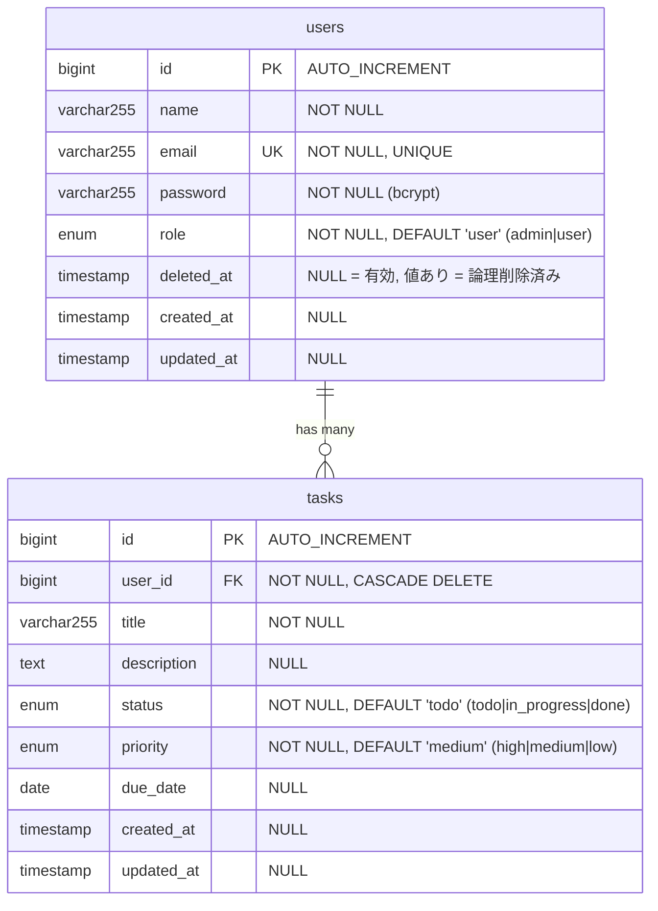

# ER図

要件定義書「5.3 ER図」および テーブル定義書（[table-definitions.md](table-definitions.md)）と対応する。

---

## ER図（Mermaid記法）

---

## リレーション説明

| リレーション       | 説明                                                                       |
| ------------------ | -------------------------------------------------------------------------- |
| users → tasks      | 1対多。1人のユーザーが複数のタスクを持つ。                                 |
| CASCADE DELETE     | usersレコードが物理削除された場合、紐づくtasksも物理削除される。           |
| SoftDeletes の注意 | usersは論理削除（deleted_at）を使用するため、論理削除ではCASCADEは発火しない。Controller内で明示的にタスクを物理削除する。 |

---

## 改訂履歴

| 版  | 日付       | 内容     |
| --- | ---------- | -------- |
| 1.0 | 2026-03-08 | 初版作成 |
