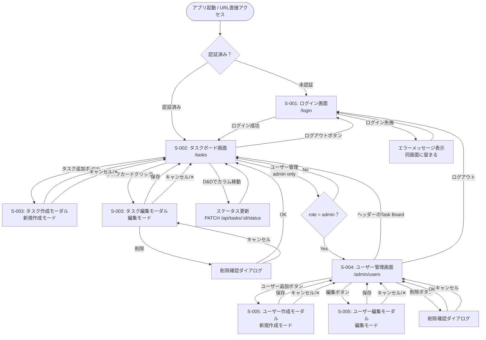

# 画面遷移図

各画面の詳細レイアウトは [design.md](design.md) を参照。
HTMLモックアップは [mockup/](mockup/) を参照。

---

## 画面遷移図（Mermaid記法）

---

## 遷移ルール一覧

### 認証ガード

| 遷移元         | 遷移先         | 条件                               |
| -------------- | -------------- | ---------------------------------- |
| 任意 → /login  | /tasks         | 認証済みの場合はリダイレクト       |
| 任意 → /tasks  | /login         | 未認証の場合はリダイレクト         |
| 任意 → /admin/users | /tasks   | 未認証 or role != 'admin' の場合   |

### ログイン

| 操作           | 遷移先             | 条件                             |
| -------------- | ------------------ | -------------------------------- |
| ログインボタン | /tasks             | 認証成功時                       |
| ログインボタン | S-001（エラー表示）| 認証失敗時                       |

### タスクボード

| 操作                 | 遷移先                     | 条件 |
| -------------------- | -------------------------- | ---- |
| ログアウトボタン     | /login                     | -    |
| タスク追加ボタン     | タスク作成モーダル（表示）  | -    |
| タスクカードクリック | タスク編集モーダル（表示）  | -    |
| D&Dでカラム移動      | 同画面（ステータス更新）    | -    |
| ユーザー管理リンク   | /admin/users               | admin のみ |

### タスクモーダル

| 操作             | 遷移先       | 条件         |
| ---------------- | ------------ | ------------ |
| 保存（成功）     | モーダルを閉じ、ボード更新 | バリデーション通過時 |
| 保存（失敗）     | モーダルを継続表示（フィールドにエラー表示） | バリデーションエラー時（422） |
| 削除ボタン       | 削除確認ダイアログ | 編集時のみ表示 |
| 削除確認 → OK    | モーダルを閉じ、タスク削除 | - |
| キャンセル / ✕  | モーダルを閉じる（変更破棄） | - |

### ユーザー管理

| 操作               | 遷移先                       | 条件               |
| ------------------ | ---------------------------- | ------------------ |
| ユーザー追加ボタン | ユーザー作成モーダル（表示）  | -                  |
| 編集ボタン         | ユーザー編集モーダル（表示）  | 有効ユーザーのみ   |
| 削除ボタン         | 削除確認ダイアログ           | 自分以外の有効ユーザー |
| 削除確認 → OK      | 同画面（論理削除後、一覧更新）| -                  |

---

## 改訂履歴

| 版  | 日付       | 内容     |
| --- | ---------- | -------- |
| 1.0 | 2026-03-08 | 初版作成 |
