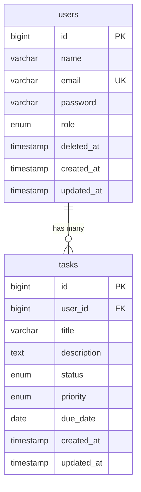

# 要件定義書

## 目次

- [1. プロジェクト概要](#1-プロジェクト概要)
  - [1.1 プロジェクト名](#11-プロジェクト名)
  - [1.2 目的](#12-目的)
  - [1.3 開発手法](#13-開発手法)
  - [1.4 技術スタック](#14-技術スタック)
  - [1.5 対応言語](#15-対応言語)
  - [1.6 動作環境](#16-動作環境)
- [2. ユーザーと役割](#2-ユーザーと役割)
  - [2.1 ユーザー種別](#21-ユーザー種別)
  - [2.2 アカウント管理方針](#22-アカウント管理方針)
- [3. 機能要件](#3-機能要件)
  - [3.1 機能一覧](#31-機能一覧)
  - [3.2 機能詳細](#32-機能詳細)
- [4. 画面一覧](#4-画面一覧)
- [5. データモデル](#5-データモデル)
  - [5.1 usersテーブル](#51-usersテーブル)
  - [5.2 tasksテーブル](#52-tasksテーブル)
  - [5.3 ER図](#53-er図mermaid)
- [6. API設計](#6-api設計)
  - [6.1 共通仕様](#61-共通仕様)
  - [6.2 エンドポイント一覧](#62-エンドポイント一覧)
- [7. 非機能要件](#7-非機能要件)
- [8. テスト方針（概要）](#8-テスト方針概要)
- [9. 初期データ（シーダー）](#9-初期データシーダー)
- [10. 用語定義](#10-用語定義)

---

## 1. プロジェクト概要

### 1.1 プロジェクト名

タスク管理アプリ（Task Board）

### 1.2 目的

ポートフォリオとして、実務で求められる技術スタック（Vue.js + Laravel + MySQL）を用いたWebアプリケーション開発能力を示す。併せて、AI駆動開発（Spec-Driven Development + Claude Code）の実践経験をアピールする。

### 1.3 開発手法

- **Spec-Driven Development（SpecDD）**: 仕様書を起点にAIと協働して開発
- **TDD（テスト駆動開発）**: テストを先行して記述し、実装を進める
- **CI/CD**: GitHub Actionsによる自動テスト・Lint

### 1.4 技術スタック

| 区分             | 技術                                           |
| ---------------- | ---------------------------------------------- |
| フロントエンド   | Vue.js 3（Composition API）+ JavaScript + Vite |
| UIフレームワーク | Tailwind CSS                                   |
| 状態管理         | Pinia                                          |
| HTTP通信         | Axios                                          |
| バックエンド     | Laravel 12（PHP 8.3）                          |
| 認証             | Laravel Sanctum（SPA認証）                     |
| データベース     | MySQL 8.4                                      |
| 開発環境         | Dev Container（Docker Compose）                |
| テスト（BE）     | PHPUnit                                        |
| テスト（FE）     | Vitest                                         |
| CI/CD            | GitHub Actions                                 |
| バージョン管理   | Git / GitHub                                   |
| AI開発支援       | Claude Code                                    |

### 1.5 対応言語

- UI言語: 日本語のみ

### 1.6 動作環境

- Mac ローカル環境上の Dev Container 内で動作
- ブラウザ: Chrome最新版（PC版のみ。スマホやタブレット等のレスポンシブ対応はスコープ外）

---

## 2. ユーザーと役割

### 2.1 ユーザー種別

| 役割                 | 説明                                                                         |
| -------------------- | ---------------------------------------------------------------------------- |
| 管理者（admin）      | システム全体を管理する。ユーザーのCRUD操作が可能。自身のタスクも管理できる。 |
| 一般ユーザー（user） | 自分のタスクのCRUD操作が可能。他ユーザーのタスクにはアクセスできない。       |

### 2.2 アカウント管理方針

- 新規ユーザー登録（サインアップ）機能は**提供しない**
- ユーザーの作成・編集・削除は**管理者のみ**が行える
- 初期データとしてシーダーで管理者1名＋一般ユーザー2名を投入

---

## 3. 機能要件

### 3.1 機能一覧

| #     | 機能名                       | 対象ユーザー | 優先度 | 概要                                            |
| ----- | ---------------------------- | ------------ | ------ | ----------------------------------------------- |
| F-001 | ログイン                     | 全員         | 必須   | メールアドレス＋パスワードによるログイン        |
| F-002 | ログアウト                   | 全員         | 必須   | セッションを破棄しログイン画面に遷移            |
| F-003 | タスク一覧表示               | 全員         | 必須   | カンバンボード形式で自分のタスクを表示          |
| F-004 | タスク作成                   | 全員         | 必須   | 新規タスクの作成                                |
| F-005 | タスク編集                   | 全員         | 必須   | 既存タスクの内容を編集                          |
| F-006 | タスク削除                   | 全員         | 必須   | タスクの削除（確認ダイアログ付き）              |
| F-007 | タスクステータス変更         | 全員         | 必須   | ドラッグ&ドロップまたはボタンでステータスを変更 |
| F-008 | タスクフィルタ（ステータス） | 全員         | 必須   | ステータスによる絞り込み表示                    |
| F-009 | タスクフィルタ（優先度）     | 全員         | 必須   | 優先度による絞り込み表示                        |
| F-010 | タスク検索                   | 全員         | 必須   | タイトル・説明文のキーワード検索                |
| F-011 | ユーザー一覧表示             | 管理者       | 必須   | 登録ユーザーの一覧を表示                        |
| F-012 | ユーザー作成                 | 管理者       | 必須   | 新規ユーザーの作成                              |
| F-013 | ユーザー編集                 | 管理者       | 必須   | ユーザー情報の編集                              |
| F-014 | ユーザー削除                 | 管理者       | 必須   | ユーザーの論理削除（関連タスクは物理削除）      |

### 3.2 機能詳細

#### F-001: ログイン

- メールアドレスとパスワードを入力してログイン
- 認証成功時、タスク一覧画面（カンバンボード）に遷移
- 認証失敗時、エラーメッセージを表示（「メールアドレスまたはパスワードが正しくありません」）
- 認証方式: Laravel Sanctum（SPA認証、Cookieベース）
- 論理削除済みユーザー（`deleted_at` が NULL でない）はログイン不可

#### F-002: ログアウト

- ヘッダーのログアウトボタンをクリックで実行
- サーバー側のセッション（トークン）を破棄
- ログイン画面にリダイレクト

#### F-003: タスク一覧表示（カンバンボード）

- 3つのカラムでタスクを表示: 「TODO」「進行中」「完了」
- 各タスクカードに表示する情報: タイトル、優先度バッジ、期限日
- 自分が作成したタスクのみ表示（他ユーザーのタスクは非表示）
- タスクカードクリックで詳細/編集モーダルを表示

#### F-004: タスク作成

- 入力項目:
  - タイトル（必須、最大255文字）
  - 説明文（任意、最大1000文字）
  - ステータス（必須、デフォルト: TODO）
  - 優先度（必須、デフォルト: 中）
  - 期限日（任意）
- モーダルまたは専用フォームで入力
- 作成成功後、カンバンボードに即座に反映

#### F-005: タスク編集

- タスクカードクリックで編集モーダルを表示
- 全項目（タイトル、説明文、ステータス、優先度、期限日）を編集可能
- 保存成功後、カンバンボードに即座に反映

#### F-006: タスク削除

- 削除ボタンクリック時に確認ダイアログを表示
- 「削除してもよろしいですか？」→ OK で削除実行
- 削除成功後、カンバンボードから該当タスクを除去

#### F-007: タスクステータス変更

- カンバンボード上でドラッグ&ドロップによりカラム間を移動
- 移動と同時にステータスをAPI経由で更新
- （フォールバック）ドラッグ&ドロップが難しい場合はセレクトボックスでの変更も可

#### F-008〜F-009: タスクフィルタ

- カンバンボード上部にフィルタ用のセレクトボックスを配置
- ステータスフィルタ: 全て / TODO / 進行中 / 完了
- 優先度フィルタ: 全て / 高 / 中 / 低
- 複数フィルタの同時適用が可能
- フィルタはフロントエンド側で適用（API再取得不要）

#### F-010: タスク検索

- カンバンボード上部に検索ボックスを配置
- タイトルおよび説明文に対するキーワード部分一致検索
- フィルタと併用可能
- 検索もフロントエンド側で適用

#### F-011: ユーザー一覧表示

- 管理者のみアクセス可能なユーザー管理画面
- テーブル形式で表示: 名前、メールアドレス、役割、作成日、削除日時（論理削除済みの場合）
- 論理削除済みユーザーも一覧に表示し、視覚的に区別する（例: 行をグレーアウト）
- ヘッダーのナビゲーションからアクセス

#### F-012: ユーザー作成

- 入力項目:
  - 名前（必須、最大255文字）
  - メールアドレス（必須、ユニーク、有効な形式）
  - パスワード（必須、最小8文字）
  - 役割（必須、admin または user）
- 作成成功後、ユーザー一覧に即座に反映

#### F-013: ユーザー編集

- 名前、メールアドレス、役割を編集可能
- パスワードは空欄の場合は変更しない
- 論理削除済みユーザーは編集不可

#### F-014: ユーザー削除（論理削除）

- 確認ダイアログ表示後に論理削除を実行
- ユーザーレコードは保持し、`deleted_at` に削除日時をセット（論理削除）
- 対象ユーザーに紐づくタスクは物理削除（CASCADE DELETE）
- 論理削除されたユーザーはログイン不可
- 自分自身は削除不可

---

## 4. 画面一覧

| #     | 画面名                    | パス         | アクセス権     | 概要                           |
| ----- | ------------------------- | ------------ | -------------- | ------------------------------ |
| S-001 | ログイン画面              | /login       | 未認証         | メール・パスワード入力フォーム |
| S-002 | タスクボード画面          | /tasks       | 全認証ユーザー | カンバンボード形式のメイン画面 |
| S-003 | タスク作成/編集モーダル   | （モーダル） | 全認証ユーザー | タスクの入力フォーム           |
| S-004 | ユーザー管理画面          | /admin/users | 管理者のみ     | ユーザー一覧テーブル + CRUD    |
| S-005 | ユーザー作成/編集モーダル | （モーダル） | 管理者のみ     | ユーザー情報の入力フォーム     |

---

## 5. データモデル

### 5.1 usersテーブル

| カラム名   | 型                    | 制約                     | 説明                                     |
| ---------- | --------------------- | ------------------------ | ---------------------------------------- |
| id         | bigint unsigned       | PK, AUTO_INCREMENT       | ユーザーID                               |
| name       | varchar(255)          | NOT NULL                 | ユーザー名                               |
| email      | varchar(255)          | NOT NULL, UNIQUE         | メールアドレス                           |
| password   | varchar(255)          | NOT NULL                 | ハッシュ化パスワード                     |
| role       | enum('admin', 'user') | NOT NULL, DEFAULT 'user' | 役割                                     |
| deleted_at | timestamp             | NULL                     | 論理削除日時（NULL = 有効、値あり = 削除済み） |
| created_at | timestamp             | NULL                     | 作成日時                                 |
| updated_at | timestamp             | NULL                     | 更新日時                                 |

> **論理削除について**: `deleted_at` が NULL のユーザーのみ有効とみなす。削除済みユーザーのレコードは監査・履歴管理のために保持する。

### 5.2 tasksテーブル

| カラム名    | 型                                  | 制約                                   | 説明         |
| ----------- | ----------------------------------- | -------------------------------------- | ------------ |
| id          | bigint unsigned                     | PK, AUTO_INCREMENT                     | タスクID     |
| user_id     | bigint unsigned                     | FK(users.id), NOT NULL, CASCADE DELETE | 所有ユーザー |
| title       | varchar(255)                        | NOT NULL                               | タイトル     |
| description | text                                | NULL                                   | 説明文       |
| status      | enum('todo', 'in_progress', 'done') | NOT NULL, DEFAULT 'todo'               | ステータス   |
| priority    | enum('high', 'medium', 'low')       | NOT NULL, DEFAULT 'medium'             | 優先度       |
| due_date    | date                                | NULL                                   | 期限日       |
| created_at  | timestamp                           | NULL                                   | 作成日時     |
| updated_at  | timestamp                           | NULL                                   | 更新日時     |

> **タスクの削除について**: ユーザーを論理削除した際、そのユーザーに紐づくタスクは物理削除される（CASCADE DELETE）。

### 5.3 ER図（Mermaid）



---

## 6. API設計

### 6.1 共通仕様

- ベースURL: `/api`
- 認証: Laravel Sanctum（Cookie認証）
- レスポンス形式: JSON
- **API仕様書**: 設計フェーズにて Swagger（OpenAPI 3.0）で定義する（`docs/design/openapi.yaml`）
- エラーレスポンス共通フォーマット:

```json
{
  "message": "エラーメッセージ",
  "errors": {
    "field_name": ["バリデーションエラー詳細"]
  }
}
```

### 6.2 エンドポイント一覧

#### 認証

| メソッド | パス        | 認証 | 説明                     |
| -------- | ----------- | ---- | ------------------------ |
| POST     | /api/login  | 不要 | ログイン                 |
| POST     | /api/logout | 必要 | ログアウト               |
| GET      | /api/user   | 必要 | ログインユーザー情報取得 |

#### タスク

| メソッド | パス                   | 認証 | 説明                           |
| -------- | ---------------------- | ---- | ------------------------------ |
| GET      | /api/tasks             | 必要 | 自分のタスク一覧取得           |
| POST     | /api/tasks             | 必要 | タスク作成                     |
| PUT      | /api/tasks/{id}        | 必要 | タスク更新（自分のタスクのみ） |
| PATCH    | /api/tasks/{id}/status | 必要 | ステータスのみ更新（D&D用）    |
| DELETE   | /api/tasks/{id}        | 必要 | タスク削除（自分のタスクのみ） |

#### ユーザー管理（管理者のみ）

| メソッド | パス                  | 認証 | 認可  | 説明                         |
| -------- | --------------------- | ---- | ----- | ---------------------------- |
| GET      | /api/admin/users      | 必要 | admin | ユーザー一覧取得（削除済み含む） |
| POST     | /api/admin/users      | 必要 | admin | ユーザー作成                 |
| PUT      | /api/admin/users/{id} | 必要 | admin | ユーザー編集                 |
| DELETE   | /api/admin/users/{id} | 必要 | admin | ユーザー論理削除             |

> **詳細なAPI仕様**: 設計フェーズにて Swagger（OpenAPI 3.0）で定義予定。

---

## 7. 非機能要件

### 7.1 セキュリティ

- パスワードはbcryptでハッシュ化して保存
- CSRF保護（Laravel Sanctum のSPA認証で自動対応）
- SQLインジェクション対策（Eloquent ORM使用）
- XSS対策（Vue.jsのテンプレートエスケープ）
- 認可チェック: 他ユーザーのタスクへのアクセスを禁止
- 論理削除済みユーザーの認証を拒否

### 7.2 パフォーマンス

- タスク一覧のレスポンス: 1秒以内（ローカル環境）
- ページネーションは不要（個人のタスク数は限定的な想定）

### 7.3 データ整合性

- ユーザー論理削除時に関連タスクをカスケード物理削除
- 外部キー制約による参照整合性の担保
- 論理削除ユーザーのメールアドレスは一意制約の対象から除外しない（再登録不可）

### 7.4 開発環境

- Dev Container によりローカル環境から分離
- docker-compose.yml で全サービスを一括起動
- ホットリロード対応（フロントエンド: Vite / バックエンド: Laravel）

---

## 8. テスト方針（概要）

| テスト種別       | ツール                         | 対象                           | 方針                      |
| ---------------- | ------------------------------ | ------------------------------ | ------------------------- |
| 単体テスト（BE） | PHPUnit                        | Model, Controller, FormRequest | TDDで先行作成             |
| 単体テスト（FE） | Vitest                         | コンポーネント, Composable     | 主要コンポーネントを対象  |
| API結合テスト    | PHPUnit Feature Test / Postman | 全APIエンドポイント            | 正常系・異常系を網羅      |
| カバレッジ       | PHPUnit --coverage             | バックエンド                   | 主要ロジック80%以上を目標 |

※詳細はテスト計画書（`docs/test-plan.md`）にて定義

---

## 9. 初期データ（シーダー）

### ユーザー

| 名前       | メールアドレス    | パスワード | 役割  |
| ---------- | ----------------- | ---------- | ----- |
| 管理者太郎 | admin@example.com | password   | admin |
| 一般花子   | user1@example.com | password   | user  |
| 一般次郎   | user2@example.com | password   | user  |

### サンプルタスク（一般花子のタスク例）

| タイトル                 | ステータス  | 優先度 | 期限  |
| ------------------------ | ----------- | ------ | ----- |
| プロジェクト計画書の作成 | todo        | high   | 7日後 |
| ミーティング資料の準備   | in_progress | medium | 3日後 |
| 週次レポートの提出       | done        | low    | 昨日  |

---

## 10. 用語定義

| 用語           | 定義                                                                            |
| -------------- | ------------------------------------------------------------------------------- |
| タスク         | ユーザーが管理するTODO項目。タイトル・説明文・ステータス・優先度・期限を持つ    |
| カンバンボード | タスクをステータス別のカラムに分けて表示するUI形式                              |
| ステータス     | タスクの進捗状態（TODO / 進行中 / 完了）                                        |
| 優先度         | タスクの重要度（高 / 中 / 低）                                                  |
| 管理者         | ユーザー管理権限を持つ特権ユーザー                                              |
| 一般ユーザー   | 自分のタスクのみ操作可能な通常ユーザー                                          |
| 論理削除       | レコードを物理的に削除せず `deleted_at` に削除日時を記録することで無効化する手法 |
| SpecDD         | Spec-Driven Development。仕様書を先に作成し、それを基に実装を進める開発手法     |
| TDD            | Test-Driven Development。テストを先行して書き、テストを通す形で実装する開発手法 |

---

## 改訂履歴

| 版  | 日付       | 内容                                       |
| --- | ---------- | ------------------------------------------ |
| 1.0 | 2026-03-07 | 初版作成（ヒアリング結果に基づくドラフト） |
| 1.1 | 2026-03-07 | 目次追加、論理削除対応、Swagger方針追記    |
